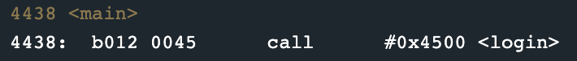
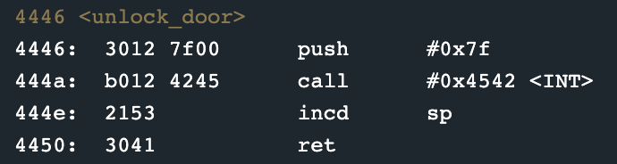
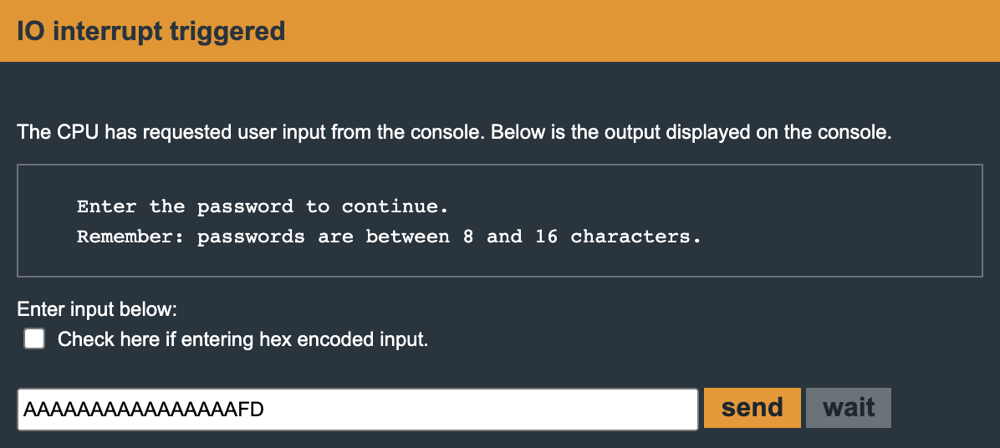

Cusco
=====

> Fourth level of Microcorruption

## Solution

So the first thing that I noticed changed was that main called a login function that contains all the logic.

Next, the conditional variable that we were able to overwrite last time has gone away, but again there is no bounds checking. We are able to overwrite the stack if we provide greater than 16 characters. The key now is to overwrite the return address on the stack so that when the login function returns, it returns to the function we want to execute. In this case, we want to execute the unlock_door function addressed at 0x4446.

We provide the following string value as the password to unlock the door: AAAAAAAAAAAAAAAAFD. FD overwrites the value on the stack with \x46\x44 which is little endian for 0x4446.  

And the door opens up!

