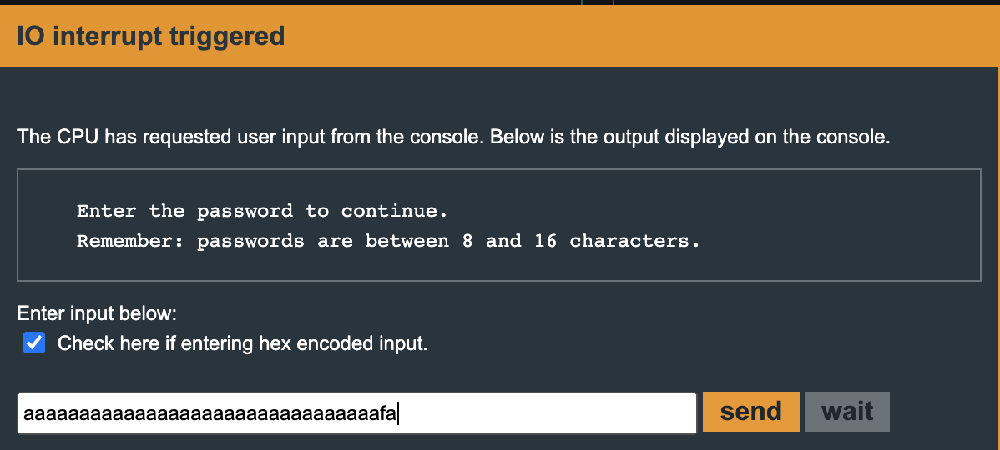

Hanoi
=====

> Third level of Microcorruption

## Solution

We notice that main contains very little since the login function handles all of the logic. According to the prompt, the password must be between 8 and 16 characters long, and I assume thats what test_password_valid does, because access is granted if the address 0x2410 contains 0xfa based on a comparison made just before the access granted message. 

Here we can see the address being passed as a parameter for getsn. We know the input password will be held in 0x2400.

Here we see the comparison being made between 0xfa and the contents of 0x2410.

Since the password is written to 0x2400, and the byte we need to compare to in order to grant access is adjacent in 0x2410, and getsn does no bounds checking, we can overwrite adjacent memory by simply providing more than 16 bytes of data as the input password. In order to overwrite 0x2410 with 0xfa, we need to check the box to enable us to write hexidecimal encoded bytes as the password.

And with that overwrite, we are granted access!

