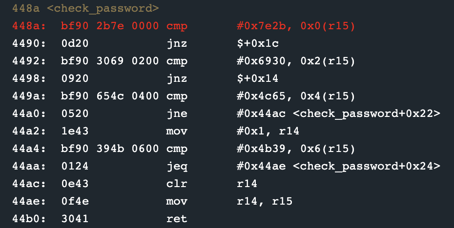
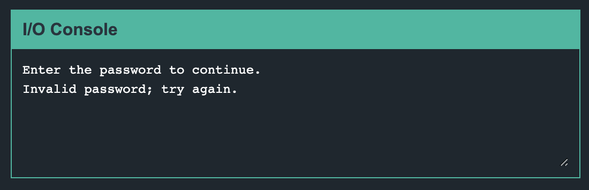
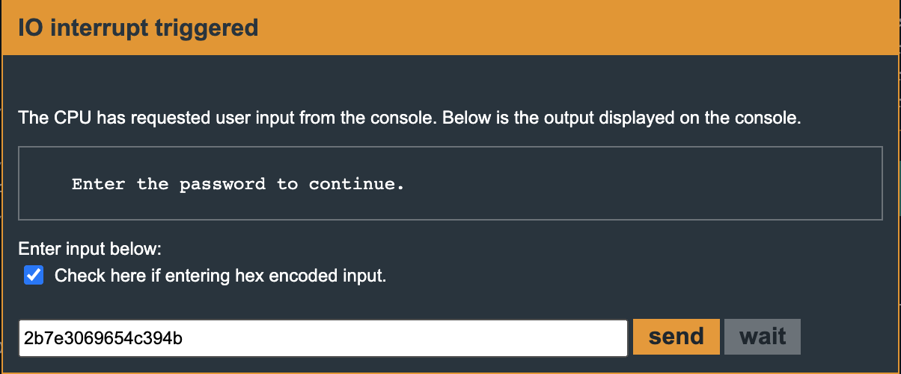

Sydney
=====

> Second level of Microcorruption

## Solution
Again, I set a breakpoint on main and continued. I noticed a get_password function, which I guessed retrieved the password input from the user, and the check_password function which I believed contained the logic I sought. I set a breakpoint on check_password and continued.

I noticed four 2-byte comparisons to r15, which held the input password. At this time it contained "test". I figured this was our password, so I annotated the bytes

> 7e2b69304c654b39

I reset the program and cleared all breakpoints since I was confident this was the password. I slammed the password in and continued only to be greeted with an invalid password message

I really racked my brain and then I thought maybe the endianness is different. Since the comparison was two bytes, I swapped each byte in the comparison and ended up with the hex encoded password below.

> 2b7e3069654c394b

This was the password that unlocked the door.

